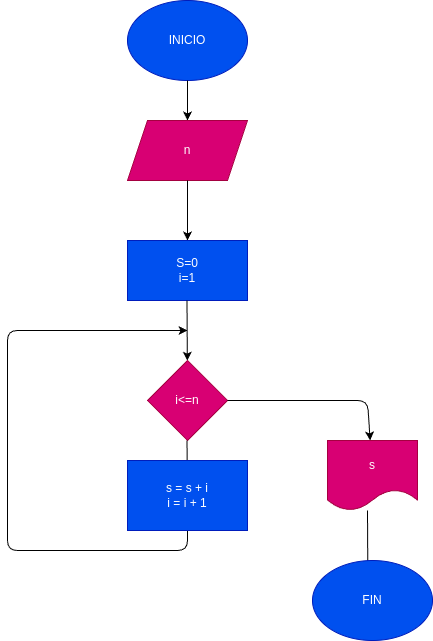

# While_1
trabajo con While en python
programa para hallar la suma de los n primeros numeros naturales
# input
variables
n= numero al cual se le suman los primeros numeros naturales
s= la suma de los primeros numeros
i= es la variable usada para sumar los primeros numeros naturales
# processing 
s=0 i =1
i<=n
s= s+i  i=i+1

# diseño

